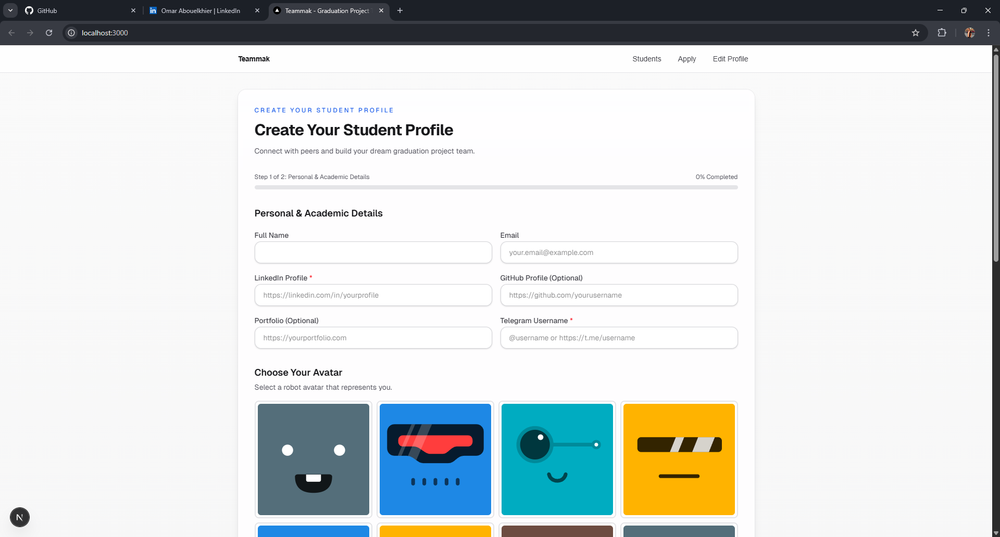
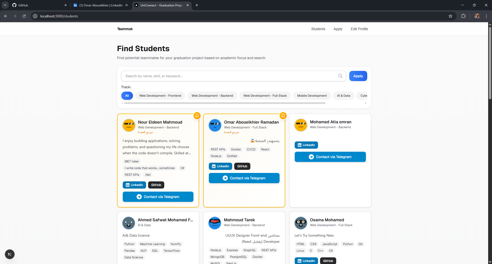
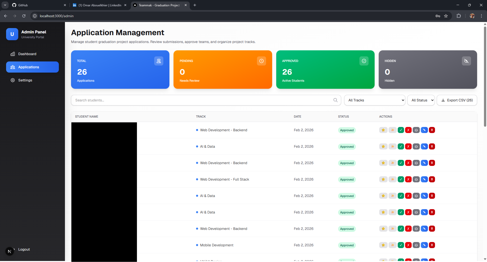

# UniConnect - Graduation Project Team Matching Platform

A modern Next.js platform for matching graduation project students and forming teams based on track, skills, and experience.

## 📸 Screenshots

<!-- Add your screenshots here -->
<!-- Example: -->
<!--  -->
<!--  -->
<!--  -->

**To add screenshots:**
1. Create a `screenshots` folder in the root directory
2. Add your images (PNG/JPG format recommended)
3. Update the paths above with your actual image filenames

## ✨ Features

- 🎓 **Student Registration**: Comprehensive application form with dynamic skill suggestions based on selected track
- 🔍 **Smart Search & Filtering**: Find students by name, skills, or track
- 📱 **Responsive Design**: Optimized for mobile (9 items/page) and desktop (21 items/page)
- 🔐 **Secure Profile Editing**: OTP-based email verification for student profile updates
- 👨‍💼 **Admin Panel**: Full management system for approving/rejecting applications
- 🎨 **Modern UI**: Beautiful, accessible interface with Tailwind CSS
- 🌐 **Arabic Text Support**: Proper RTL support for Arabic content in bio fields
- 📊 **Pagination**: Efficient pagination system to handle large student lists
- 🔗 **Social Links**: Direct links to LinkedIn, GitHub, Portfolio, and Telegram

## 🚀 Tech Stack

- **Framework**: Next.js 16.1.4
- **Language**: TypeScript
- **Styling**: Tailwind CSS 4
- **Database**: MongoDB
- **Email Service**: SendGrid / Resend
- **UI Components**: Custom components with React 19

## 📋 Prerequisites

- Node.js 18+
- MongoDB Atlas account
- SendGrid or Resend account (for email OTP)

## ⚙️ Environment Variables

Create a `.env.local` file in the root directory:

```env
MONGODB_URI=your_mongodb_atlas_connection_string
MONGODB_DB=graduation_teams
ADMIN_SECRET_KEY=your_secure_admin_secret_key
SENDGRID_API_KEY=SG.your_sendgrid_api_key
SENDGRID_FROM_EMAIL=any-email@example.com
# OR use Resend:
# RESEND_API_KEY=re_your_resend_api_key
# RESEND_FROM_EMAIL=noreply@yourdomain.com
SITE_NAME=UniConnect
```

## 📧 Email Service Setup

### SendGrid (Recommended for Testing)

**Why SendGrid?**
- ✅ No domain verification needed for testing
- ✅ Can send to any email address
- ✅ 100 emails/day free tier
- ✅ Perfect for development and testing

**Setup Steps:**

1. Sign up at [SendGrid.com](https://sendgrid.com) (free account)
2. Go to **Settings** → **API Keys** in the dashboard
3. Click **Create API Key**
4. Give it a name (e.g., "UniConnect OTP")
5. Select **Full Access** or **Restricted Access** (with Mail Send permissions)
6. Copy the API key (starts with `SG.`)
7. Add it to `.env.local`:
   ```env
   SENDGRID_API_KEY=SG.your_actual_api_key_here
   SENDGRID_FROM_EMAIL=any-email@example.com
   ```

**Free Tier**: 100 emails/day (3,000/month) - No domain verification needed!

### Resend (Alternative)

Resend requires domain verification for production use but offers similar free tier.

## 🛠️ Installation

1. Clone the repository:
```bash
git clone https://github.com/OmarAbouelkheirr/graduation-team-builder.git
cd graduation-team-builder
```

2. Install dependencies:
```bash
npm install
# or
yarn install
# or
pnpm install
```

3. Set up environment variables (see above)

4. Run the development server:
```bash
npm run dev
# or
yarn dev
# or
pnpm dev
```

5. Open [http://localhost:3000](http://localhost:3000) in your browser

## 📁 Project Structure

```
├── src/
│   ├── app/
│   │   ├── _components/     # Reusable components
│   │   ├── admin/          # Admin panel pages
│   │   ├── api/             # API routes
│   │   ├── edit/            # Student profile editing
│   │   ├── students/        # Public student directory
│   │   └── page.tsx         # Home/registration page
│   └── lib/                 # Utility functions
├── public/                  # Static assets
└── screenshots/            # Screenshots (create this folder)
```

## 🎯 Key Features Explained

### Student Registration
- Dynamic skill suggestions based on selected track
- Avatar selection from predefined options
- Bio field with Arabic text support
- Automatic Telegram username extraction from links

### Search & Filter
- Real-time search by name, skills, or keywords
- Filter by academic track
- Debounced search for better performance

### Pagination
- Mobile: 9 items per page (optimized for 2-column grid)
- Desktop: 21 items per page (optimized for 3-column grid)
- Smart pagination controls with page numbers

### Admin Features
- Approve/reject student applications
- Edit student profiles
- Manage site settings
- Featured and special student badges

## 🐛 Troubleshooting

### Email Issues
- Check server console for error messages
- Verify `SENDGRID_API_KEY` is in `.env.local`
- Restart dev server after adding environment variables
- Check SendGrid dashboard → **Activity** for delivery status
- Ensure API key has "Mail Send" permissions

### Database Issues
- Verify MongoDB connection string is correct
- Check MongoDB Atlas IP whitelist settings
- Ensure database name matches `.env.local`

## 📚 Learn More

- [Next.js Documentation](https://nextjs.org/docs)
- [Tailwind CSS Documentation](https://tailwindcss.com/docs)
- [MongoDB Atlas Documentation](https://docs.atlas.mongodb.com)

## 🚢 Deployment

### Deploy on Vercel

The easiest way to deploy your Next.js app:

1. Push your code to GitHub
2. Import your repository on [Vercel](https://vercel.com/new)
3. Add your environment variables
4. Deploy!

[](https://vercel.com/new/clone?repository-url=https://github.com/OmarAbouelkheirr/graduation-team-builder)

## 📝 License

This project is open source and available under the [MIT License](LICENSE).

## 👨‍💻 Developer

**Omar Abouelkhier**

- 📱 Telegram: [@YourTelegramUsername](https://t.me/YourTelegramUsername)
- 💼 LinkedIn: [Your LinkedIn Profile](https://linkedin.com/in/yourprofile)
- 🌐 GitHub: [@OmarAbouelkheirr](https://github.com/OmarAbouelkheirr)

---

Made with ❤️ by Omar Abouelkhier
